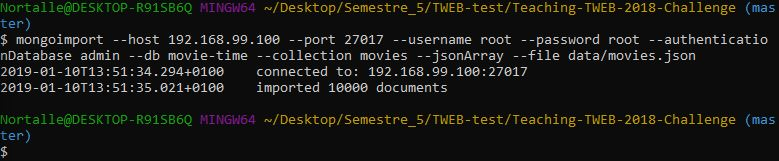

# The Movie Challenge

Pour réussir ce challenge, nous vous laissons le choix de développer soit une application frontend (Movie Explorer), soit une application backend (Movie Time).

Le rendu se fera via [ce formulaire Google Forms](https://goo.gl/nwZUVk) dans lequel nous vous demandons notamment l'URL de votre application, ainsi que celui de votre repository GitHub (contenant votre code ainsi qu'un fichier README.md qui explique succinctement comment démarrer et tester votre application).

## Option 2 : Movie Time (backend)

Vincent Guidoux

**Prélude**

_Tout comme le hibou, Djevijd est un homme qui préfère travailler la nuit. Tout le monde en est bien conscient. Il n'est cependant pas à blâmer : en effet, quoi de mieux que de repousser les ennuyeux problèmes à plus tard en exerçant la **fameuse** technique de l'autruche ? Osons le dire, c'est un procédé qui a su séduire et faire ses preuves parmi nombre d'entre nous.
Ceci dit, d'autres se questionnent quant aux occupations de notre protagoniste durant la journée. Que peut-il bien faire de son temps libre, mis à part la création de memes larbinesques ? Eh bien... Il regarde des films, pardi ! Même s'il est ouvert à tous les genres, ses préférences s'orientent tout de même sur les films comiques qu'il raffole. D'autres vous dirons mêmes qu'ils ont parfois pu entendre des rires féminins s'échapper de son ordinateur !
En bon procrastinateur, notre personnage vous demande aimablement de lui coder une petite API permettant de gérer des films, ainsi qu'une watchlist._

**Introduction**

Si vous optez pour cette option, vous allez devoir développer une API permettant de récupérer des informations sur des films. Depuis cette API, les utilisateurs auront la possibilité de récupérer une liste de films populaires et de gérer leur *watchlist* (liste des films à voir plus tard).

**Consigne**

- Mettre en place un environnement de développement backend (repo, linter) avec Node.js
- Implémenter une API REST ou GraphQL.
- Persister les données dans une base de donnée MongoDB avec un ORM tels que Mongoose ou équivalent.
- Implémenter les fonctionnalités et endpoints demandés dans les étapes qui suivent.
- Déployer votre application en ligne. Ne perdez pas trop de temps sur ce point, et mettez une priorité plus élevée sur les autres étapes si besoin.


### 1. Importer une collection de films (0.5pt)

Le fichier `movies.json` fourni contient une liste de 10’000 films à importer dans votre base de donnée. Pour cela vous pouvez utiliser la commande `mongoimport` expliquée ci-dessous.

**Example en localhost**

Cette commande peut être utilisé de la manière suivante pour importer un fichier dans une base de donnée locale.

```
mongoimport --host localhost --port 27017 --db movie-time --collection movies --drop --file data/movies.json --jsonArray
```

 `--drop` permet de vider la collection avant l'importation, `--jsonArray` permet d'importer un tableau JSON et `db` est le nom de la base de donnée.


**Exemple avec Mongo Atlas**

Lors du déploiement de votre API, vous aurez également besoin d'une base de donnée en ligne. Pour cela vous pouvez par exemple utiliser [MongoDB Atlas](https://www.mongodb.com/cloud/atlas)

Afin de pouvoir exécuter la commande `mongoimport` vous devez au préalable : 

- posséder un compte Mongo Atlas avec un cluster actif.

- avoir créé un MongoDB user configurable depuis l’onglet "Clusters > Security > MongoDB users".

- avoir inclu l'adresse IP courante dans la whitelist depuis l'onglet "Clusters > Security > IP Whitelist".

- connaître la valeur du `DATABASE_HOST`, qui doit avoir la forme suivante:

  ```
  <NOM_DU_REPLICASET>/<HOST_1:port>,<HOST_2:port>,<HOST_3:port>
  ```
  Pour trouver cette url ainsi que la commande à exécuter, naviguez vers l'onglet "Command Line tools" de votre cluster.

```
mongoimport --host myAtlasRS/atlas-host1:27017,atlas-host2:27017,atlas-host3:27017 --ssl --username myAtlasUsername --password myAtlasPassword --authenticationDatabase admin --db movie-time --collection movies --jsonArray --file data/movies.json
```


**Vérification**

Si l’opération s’est bien déroulée, le message `imported 10000 documents` devrait s'afficher dans le terminal.


**Répartion des points:**

- (1pt) – Les films ont étés importés dans un MongoDB local ou distant. Ajoutez un screenshot du résultat de l'opération dans votre README.md.




### 2. Liste des films (3pt)

Une fois la collection de films importée, vous allez devoir créer un model `Movie` ainsi qu'un endpoint permettant de récupérer une liste paginée des films.

**Répartion des points:**

- (1pt) – vous avez utilisé l’ORM de votre choix pour créer le model `Movie` contenant toutes les propriétés définies dans le dataset.
- (1pt) – vous avez créé un endpoint /movies permettant de récupérer la liste complète des films.
- (1pt) - vous avez utilisé la méthode de votre choix pour paginer les résultats de cet endpoint.


### 3. Authentification (3pt)

Dans cette étape vous allez devoir créer un model `User` ainsi qu'un endpoint permettant de créer un utilisateur et de s'authentifier. Pour ce faire, vous avez le choix d'utiliser les outils que vous souhaitez (tels que [passportjs](http://www.passportjs.org), par exemple), la seule condition étant que les utilisateurs soient stockés dans votre base de donnée MongoDB.

Si vous optez pour une solution avec [express](https://expressjs.com/fr/) + [jsonwebtoken](https://github.com/auth0/node-jsonwebtoken) vous pouvez vous baser sur les exemples suivants:

- `/auth/register` (création d'un nouvel utilisateur) :

  ```js
  app.post('/auth/register', (req, res) => {
    const { username, password } = req.body;
    // register a user and send 201 Created.
  });
  ```

- `/auth/login` (authentification) :

  ```js
  const jwt = require('jsonwebtoken');
  
  app.post('auth/login', (req, res) => {
    const { username, password } = req.body;
    // check the credentials
    // generate a token token -> jwt.sign()
    // include the userId inside the token's payload
    // if the check fails, send 401 Unauthorized
  })
  ```

- *(Bonus) middleware d'authentification*

  ```js
  const jwt = require('jsonwebtoken');
  
  app.use((req, res, next) => {
    const token = req.headers.authorization;
    // verify the token -> jwt.verify()
    // attach the payload to req.user
    // call next() when you're done
  })
  ```


**Répartition des points:**

- (1pt) – le Model `User` contient au minium le nom d'utilisateur ou l'email, ainsi que le mot de passe. Pour ce challenge, nous acceptons les mots de passe stockés en clair à condition qu’ils ne soient jamais retournés à l’utilisateur.
- (1pt) – lors de la création d'un nouvel utilisateur, l'API envoie le status `201 Created`. Le nom d'utilisateur et l'email sont uniques.
- (1pt) – lors du login, l'API retourne un token de type JWT qui contient au minimum l'id de l'utilisateur.
- *(BONUS 0.5pt) – vous avez implémenté (à la main ou à l'aide d'une libraire) un middleware qui attache l’utilisateur courant à l’objet requête `req.user`.* 

### 4. Watchlist (2pt)

Vous allez ici devoir ajouter et implémenter la fonctionnalité *watchlist* (liste de films à regarder) liée aux utilisateurs. Pour ce faire, vous devez adapter la structure de la base de donnée et ajouter des endpoints permettant de récupérer des *watchlists* et de les modifier.

**Répartition des points:**

- (1pt) - il est possible de récupérer la liste des films se trouvant dans la watchlist d’un utilisateur (retourner une liste d’identifiants n’est pas suffisant).
- (1pt) – il est possible d'ajouter un film dans la *watchlist* d’un utilisateur. 
- *(BONUS 0.5pt) : vous avez sécurisé les endpoints afin de les rendres accessibles uniquement aux utilisateurs connectés. Utiliser l’id de l’utilisateur connecté lors de l’ajout d’un film dans une watchlist.*


### 5. (Bonus) Formulaire de login (0.5pt)

Vous implémentez une application statique avec un formulaire de login.


### 6. Qualité du code (1.25pt)

Les points pour cette étape sont répartis de la manière suivante :

- (0.25pt) – la structure des fichiers est cohérente.
- (0.25pt) – tout code non utilisé est supprimé y compris les logs de debug dans la console.
- (0.25pt) – votre code est suffisament documenté lorsque cela est nécessaire.
- (0.25pt) – vous utilisez un linter.
-  (0.25pt) – les variables d’environnement sont utilisées lorsque cela est nécessaire.
- *(BONUS 0.5pt): vous avez créé au moins un test unitaire afin de valider la fonctionnalité de votre choix.*

### 7. Déploiement (0.5pt)

Finalement vous devez déployer votre API et votre base de données sur la plateforme de votre choix.
